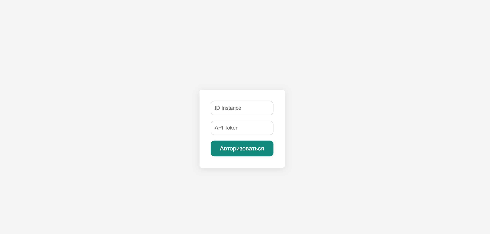
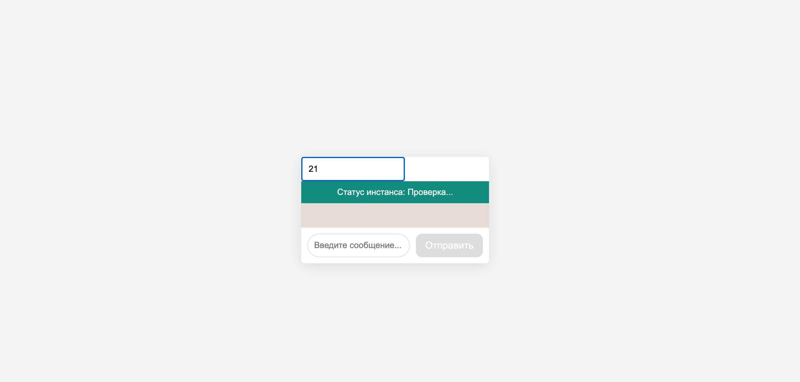

#  WhatsApp Clone


## 📌 Описание

Этот проект представляет собой клон WhatsApp, созданный с использованием **React** и **Green API**. Он позволяет отправлять и получать сообщения через WhatsApp с помощью API.

## 🚀 Функционал

- Авторизация через **ID Instance** и **API Token**
- Отправка сообщений на указанный номер WhatsApp
- Прием входящих сообщений
- Проверка статуса инстанса
- Автоматическая очистка очереди уведомлений

## 🛠️ Технологии

- **React** (хуки: useState, useEffect)
- **Axios** (запросы к API)
- **Green API** (интеграция с WhatsApp)

## 🔧 Установка и запуск

1. **Клонируйте репозиторий:**

   ```bash
   git clone https://github.com/yogurtt77/WhatsappGreenapi.git
2. **Перейдите в папку проекта**
   ```bash
   cd WhatsappGreenapi
3. **Установите зависимости:**
   ```bash
   npm install
4. **Запустите проект:**
   ```bash
   npm start

## 📸 Скринштоы



## 🔑 Использование

1. Введите ID Instance и API Token (получите их на Green API).
2. Введите номер телефона получателя в формате 79991234567.
3. Отправляйте и получайте сообщения!

## 🤝 Вклад
Буду рад любому вкладу! Делайте fork, создавайте pull request и помогайте улучшать проект.

## 🚀 Демо

Посмотреть вживую: [Живой сайт]([https://myusername.github.io/my-project/)](https://whatsappgreenapi.onrender.com/)

